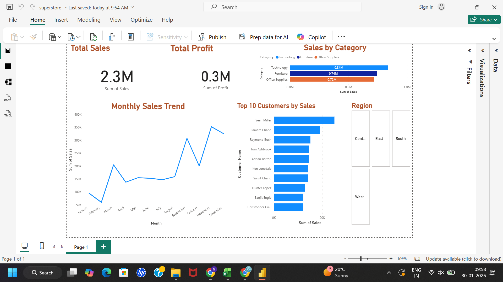

# Power BI Superstore Sales Dashboard

## 📊 Project Overview
This project presents an **interactive sales analysis dashboard** built using **Microsoft Power BI**.  
The dashboard analyzes Superstore sales data to uncover insights related to **sales performance, profit trends, customer behavior, and regional performance**.

---

## 🎯 Objectives
- Analyze overall **sales and profit performance**
- Identify **top-performing categories and customers**
- Track **monthly sales trends**
- Compare **regional sales performance**
- Enable data-driven business decisions through visualization

---

## 🛠 Tools & Technologies
- **Power BI Desktop**
- **Microsoft Excel / CSV**
- **Data Visualization**
- **Data Cleaning & Modeling**

---

## 📁 Dataset
- **Source:** Sample Superstore Dataset  
- **File:** `Sample - Superstore.csv`  
- **Description:** Contains order-level sales data including region, category, customer, sales, profit, and dates.

---

## 📌 Dashboard Features
- **KPI Cards:**  
  - Total Sales  
  - Total Profit  

- **Visualizations:**  
  - Sales by Category  
  - Monthly Sales Trend  
  - Top 10 Customers by Sales  
  - Regional Sales Distribution  

- **Interactivity:**  
  - Filters and slicers for dynamic analysis  

---

## 🖼 Dashboard Preview

---

## 📂 Repository Structure

